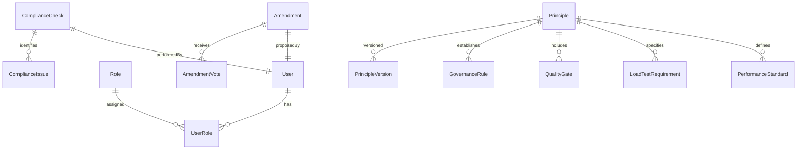

# Data Model: Constitution Application

**Date**: 2025-12-17
**Feature**: 001-constitution-app
**Database**: PostgreSQL with TypeORM

## Overview

This document defines the database entities and relationships for the NestJS-based constitution application. The data model supports dynamic content management, version control, and compliance tracking while maintaining performance and scalability requirements.

## Entity Relationship Diagram



## Core Entities

### 1. User

Manages user authentication and authorization.

```typescript
@Entity('users')
export class User {
  @PrimaryGeneratedColumn('uuid')
  id: string;

  @Column({ unique: true })
  email: string;

  @Column()
  passwordHash: string;

  @Column()
  name: string;

  @Column({ nullable: true })
  avatar?: string;

  @CreateDateColumn()
  createdAt: Date;

  @UpdateDateColumn()
  updatedAt: Date;

  @Column({ default: true })
  isActive: boolean;

  @Column({ type: 'timestamp', nullable: true })
  lastLoginAt?: Date;

  // Relationships
  @OneToMany(() => UserRole, (role) => role.user)
  roles: UserRole[];

  @OneToMany(() => Amendment, (amendment) => amendment.proposedBy)
  proposedAmendments: Amendment[];

  @OneToMany(() => ComplianceCheck, (check) => check.performedBy)
  performedChecks: ComplianceCheck[];
}
```

### 2. Role

Defines user roles for RBAC.

```typescript
@Entity('roles')
export class Role {
  @PrimaryGeneratedColumn()
  id: number;

  @Column({ unique: true })
  name: string;

  @Column()
  description: string;

  @Column({ type: 'jsonb' })
  permissions: string[];

  @CreateDateColumn()
  createdAt: Date;

  @UpdateDateColumn()
  updatedAt: Date;

  // Relationships
  @OneToMany(() => UserRole, (role) => role.role)
  users: UserRole[];
}
```

### 3. UserRole

Join table for user-role many-to-many relationship.

```typescript
@Entity('user_roles')
export class UserRole {
  @PrimaryGeneratedColumn()
  id: number;

  @ManyToOne(() => User, (user) => user.roles)
  user: User;

  @ManyToOne(() => Role, (role) => role.users)
  role: Role;

  @Column({ type: 'timestamp' })
  assignedAt: Date;

  @Column({ nullable: true })
  assignedBy?: string;
}
```

### 4. Principle

Core constitution principles with versioning support.

```typescript
@Entity('principles')
export class Principle {
  @PrimaryGeneratedColumn('uuid')
  id: string;

  @Column({ unique: true })
  slug: string;

  @Column()
  title: string;

  @Column('text')
  description: string;

  @Column({ default: 1 })
  priority: number; // 1 = highest

  @Column('jsonb')
  metadata: {
    category: string;
    tags: string[];
    relatedPrinciples: string[];
    examples: Array<{
      type: 'code' | 'diagram' | 'text';
      title: string;
      content: string;
      language?: string;
    }>;
  };

  @Column({ default: true })
  isActive: boolean;

  @CreateDateColumn()
  createdAt: Date;

  @UpdateDateColumn()
  updatedAt: Date;

  // Version tracking
  @Column({ default: '1.0.0' })
  currentVersion: string;

  // Relationships
  @OneToMany(() => PrincipleVersion, (version) => version.principle)
  versions: PrincipleVersion[];

  @OneToMany(() => PerformanceStandard, (standard) => standard.principle)
  performanceStandards: PerformanceStandard[];

  @OneToMany(() => LoadTestRequirement, (req) => req.principle)
  loadTestRequirements: LoadTestRequirement[];

  @OneToMany(() => QualityGate, (gate) => gate.principle)
  qualityGates: QualityGate[];

  @OneToMany(() => GovernanceRule, (rule) => rule.principle)
  governanceRules: GovernanceRule[];
}
```

### 5. PrincipleVersion

Tracks version history of principles.

```typescript
@Entity('principle_versions')
export class PrincipleVersion {
  @PrimaryGeneratedColumn()
  id: number;

  @ManyToOne(() => Principle, (principle) => principle.versions)
  principle: Principle;

  @Column()
  version: string;

  @Column('text')
  title: string;

  @Column('text')
  description: string;

  @Column('jsonb')
  metadata: any;

  @Column()
  changeLog: string;

  @Column()
  authorId: string;

  @Column({ type: 'timestamp' })
  effectiveDate: Date;

  @CreateDateColumn()
  createdAt: Date;
}
```

### 6. PerformanceStandard

Defines performance metrics and targets.

```typescript
@Entity('performance_standards')
export class PerformanceStandard {
  @PrimaryGeneratedColumn('uuid')
  id: string;

  @ManyToOne(() => Principle, (principle) => principle.performanceStandards)
  principle: Principle;

  @Column()
  name: string;

  @Column()
  endpointType: string; // authentication, search, payment, etc.

  @Column()
  targetResponseTime: number; // in milliseconds

  @Column()
  metricType: string; // 95th_percentile, average, max

  @Column()
  concurrentUsers: number;

  @Column('jsonb')
  additionalMetrics: {
    cpuUsage?: number;
    memoryUsage?: number;
    errorRate?: number;
  };

  @Column('text', { nullable: true })
  description?: string;

  @Column({ default: true })
  isActive: boolean;

  @CreateDateColumn()
  createdAt: Date;

  @UpdateDateColumn()
  updatedAt: Date;
}
```

### 7. LoadTestRequirement

Specifies k6 load testing requirements.

```typescript
@Entity('load_test_requirements')
export class LoadTestRequirement {
  @PrimaryGeneratedColumn('uuid')
  id: string;

  @ManyToOne(() => Principle, (principle) => principle.loadTestRequirements)
  principle: Principle;

  @Column()
  name: string;

  @Column()
  testType: string; // smoke, load, stress, spike

  @Column()
  endpointPattern: string; // /api/auth/*

  @Column('jsonb')
  testParameters: {
    rampUp: {
      from: number;
      to: number;
      duration: string; // 5m
    };
    constantLoad?: {
      users: number;
      duration: string;
    };
    stress?: {
      load: string; // 150% of expected
      duration: string;
    };
  };

  @Column()
  expectedRate: number; // requests per second

  @Column()
  maxResponseTime: number; // in milliseconds

  @Column()
  maxErrorRate: number; // percentage

  @Column({ nullable: true })
  scriptPath?: string; // path to k6 script

  @Column({ default: true })
  isActive: boolean;

  @CreateDateColumn()
  createdAt: Date;

  @UpdateDateColumn()
  updatedAt: Date;
}
```

### 8. QualityGate

Defines compliance checkpoints.

```typescript
@Entity('quality_gates')
export class QualityGate {
  @PrimaryGeneratedColumn('uuid')
  id: string;

  @ManyToOne(() => Principle, (principle) => principle.qualityGates)
  principle: Principle;

  @Column()
  name: string;

  @Column()
  type: 'automated' | 'manual';

  @Column()
  tool?: string; // Jest, k6, npm audit, etc.

  @Column('text')
  requirement: string;

  @Column('jsonb')
  criteria: {
    threshold?: number;
    unit?: string;
    conditions?: Array<{
      field: string;
      operator: string;
      value: any;
    }>;
  };

  @Column({ default: true })
  isRequired: boolean;

  @Column({ default: true })
  isActive: boolean;

  @CreateDateColumn()
  createdAt: Date;

  @UpdateDateColumn()
  updatedAt: Date;
}
```

### 9. GovernanceRule

Establishes governance and amendment rules.

```typescript
@Entity('governance_rules')
export class GovernanceRule {
  @PrimaryGeneratedColumn('uuid')
  id: string;

  @ManyToOne(() => Principle, (principle) => principle.governanceRules)
  principle: Principle;

  @Column()
  ruleType: 'amendment' | 'compliance' | 'approval' | 'enforcement';

  @Column()
  title: string;

  @Column('text')
  description: string;

  @Column('jsonb')
  parameters: {
    requiredVotes?: number;
    votingPeriod?: string; // 3 business days
    approvalProcess?: string[];
    escalationPath?: string[];
    remediationPlan?: boolean;
  };

  @Column({ default: true })
  isActive: boolean;

  @Column({ type: 'timestamp', nullable: true })
  effectiveFrom?: Date;

  @Column({ type: 'timestamp', nullable: true })
  effectiveTo?: Date;

  @CreateDateColumn()
  createdAt: Date;

  @UpdateDateColumn()
  updatedAt: Date;
}
```

### 10. Amendment

Tracks proposed constitution amendments.

```typescript
@Entity('amendments')
export class Amendment {
  @PrimaryGeneratedColumn('uuid')
  id: string;

  @Column()
  title: string;

  @Column('text')
  description: string;

  @Column()
  type: 'addition' | 'modification' | 'removal';

  @Column('jsonb')
  changes: {
    entityType: string;
    entityId: string;
    oldValue?: any;
    newValue: any;
    impact: string;
  }[];

  @Column()
  status: 'proposed' | 'under_review' | 'approved' | 'rejected' | 'implemented';

  @ManyToOne(() => User, (user) => user.proposedAmendments)
  proposedBy: User;

  @Column({ type: 'timestamp' })
  proposedAt: Date;

  @Column({ type: 'timestamp', nullable: true })
  votingStartsAt?: Date;

  @Column({ type: 'timestamp', nullable: true })
  votingEndsAt?: Date;

  @Column({ type: 'timestamp', nullable: true })
  implementedAt?: Date;

  @Column({ nullable: true })
  migrationPlan?: string;

  // Relationships
  @OneToMany(() => AmendmentVote, (vote) => vote.amendment)
  votes: AmendmentVote[];
}
```

### 11. AmendmentVote

Records votes on amendments.

```typescript
@Entity('amendment_votes')
export class AmendmentVote {
  @PrimaryGeneratedColumn()
  id: number;

  @ManyToOne(() => Amendment, (amendment) => amendment.votes)
  amendment: Amendment;

  @ManyToOne(() => User)
  voter: User;

  @Column()
  vote: 'approve' | 'reject' | 'abstain';

  @Column({ nullable: true })
  comment?: string;

  @Column({ type: 'timestamp' })
  votedAt: Date;

  // Ensure one vote per user per amendment
  @Unique(['amendment', 'voter'])
}
```

### 12. ComplianceCheck

Records compliance verification activities.

```typescript
@Entity('compliance_checks')
export class ComplianceCheck {
  @PrimaryGeneratedColumn('uuid')
  id: string;

  @Column()
  entityType: string; // principle, performance_standard, etc.

  @Column()
  entityId: string;

  @Column()
  checkType: string; // manual_review, automated_test, security_scan

  @Column()
  status: 'passed' | 'failed' | 'warning' | 'pending';

  @Column('jsonb', { nullable: true })
  results?: {
    score?: number;
    issues?: string[];
    metrics?: Record<string, number>;
  };

  @Column('text', { nullable: true })
  notes?: string;

  @ManyToOne(() => User, (user) => user.performedChecks)
  performedBy: User;

  @Column({ type: 'timestamp' })
  performedAt: Date;

  // Relationships
  @OneToMany(() => ComplianceIssue, (issue) => issue.check)
  issues: ComplianceIssue[];
}
```

### 13. ComplianceIssue

Tracks specific compliance issues found.

```typescript
@Entity('compliance_issues')
export class ComplianceIssue {
  @PrimaryGeneratedColumn('uuid')
  id: string;

  @ManyToOne(() => ComplianceCheck, (check) => check.issues)
  check: ComplianceCheck;

  @Column()
  severity: 'low' | 'medium' | 'high' | 'critical';

  @Column()
  title: string;

  @Column('text')
  description: string;

  @Column({ nullable: true })
  remediationSteps?: string;

  @Column()
  status: 'open' | 'in_progress' | 'resolved' | 'ignored';

  @Column({ nullable: true })
  assignedTo?: string;

  @Column({ type: 'timestamp', nullable: true })
  resolvedAt?: Date;

  @CreateDateColumn()
  createdAt: Date;

  @UpdateDateColumn()
  updatedAt: Date;
}
```

## Database Indexes

```sql
-- Performance optimization indexes
CREATE INDEX idx_principles_slug ON principles(slug);
CREATE INDEX idx_principles_active ON principles(is_active) WHERE is_active = true;
CREATE INDEX idx_performance_standards_type ON performance_standards(endpointType, is_active);
CREATE INDEX idx_load_test_requirements_active ON load_test_requirements(is_active) WHERE is_active = true;
CREATE INDEX idx_compliance_checks_entity ON compliance_checks(entityType, entityId);
CREATE INDEX idx_amendments_status ON amendments(status);
CREATE INDEX idx_amendments_voting ON amendments(status, votingStartsAt, votingEndsAt);

-- Full-text search indexes
CREATE INDEX idx_principles_search ON principles USING gin(to_tsvector('english', title || ' ' || description));
CREATE INDEX idx_compliance_issues_search ON compliance_issues USING gin(to_tsvector('english', title || ' ' || description));

-- JSONB indexes for efficient querying
CREATE INDEX idx_principles_metadata ON principles USING gin(metadata);
CREATE INDEX idx_performance_standards_metrics ON performance_standards USING gin(additional_metrics);
CREATE INDEX idx_load_test_params ON load_test_requirements USING gin(test_parameters);
```

## Data Validation Rules

### Principle Validation
- `slug`: Unique, lowercase, hyphen-separated, max 50 chars
- `title`: Required, max 200 chars
- `description`: Required, min 10 chars
- `priority`: 1-5, where 1 is highest
- `currentVersion`: Must follow semantic versioning

### Performance Standards
- `targetResponseTime`: Positive integer, max 10000ms
- `metricType`: Must be one of: 95th_percentile, average, max, min
- `concurrentUsers`: Positive integer, max 100000

### Load Test Requirements
- `expectedRate`: Positive integer, max 10000 req/s
- `maxResponseTime`: Must be >= target response time
- `maxErrorRate`: Percentage between 0-100

### Quality Gates
- `type`: Must be either 'automated' or 'manual'
- `isRequired`: Boolean, determines if gate blocks deployment

## Migration Strategy

### Initial Migration (v1.0.0)
```sql
-- Create all tables with initial data
INSERT INTO roles (name, description, permissions) VALUES
  ('admin', 'Full system access', ['*']),
  ('editor', 'Can edit constitution', ['read', 'write', 'approve']),
  ('viewer', 'Read-only access', ['read']);

-- Insert initial principles
INSERT INTO principles (slug, title, description, priority, metadata) VALUES
  ('rest-api-first', 'REST API First', '...', 1, '{"category": "api", "tags": ["rest", "api"]}'),
  ('database-integration', 'Database Integration', '...', 2, '{"category": "data", "tags": ["database", "typeorm"]}'),
  ('load-testing-discipline', 'Load Testing Discipline', '...', 3, '{"category": "testing", "tags": ["k6", "performance"]}'),
  ('security-by-default', 'Security by Default', '...', 4, '{"category": "security", "tags": ["jwt", "encryption"]}'),
  ('testing-coverage', 'Testing Coverage', '...', 5, '{"category": "testing", "tags": ["jest", "coverage"]}');
```

### Versioning Migration
When principles are amended:
1. Create new version in `principle_versions`
2. Update `current_version` in `principles`
3. Create amendment record
4. Track votes through `amendment_votes`

## Performance Considerations

1. **Read Optimization**: Frequently accessed data (principles, performance standards) are indexed and cached
2. **Write Optimization**: Audit tables use bulk inserts for performance
3. **Search Performance**: Full-text search indexes on principle content
4. **Connection Pooling**: Configure for expected concurrent users
5. **Query Optimization**: Use specific indexes for common query patterns

## Security Considerations

1. **Data Encryption**: Sensitive columns encrypted at rest using pgcrypto
2. **Row Level Security**: Implement RLS for multi-tenant scenarios
3. **Audit Trail**: All modifications tracked with user and timestamp
4. **Input Validation**: Strict validation at entity and DTO level
5. **SQL Injection Prevention**: Always use parameterized queries via TypeORM